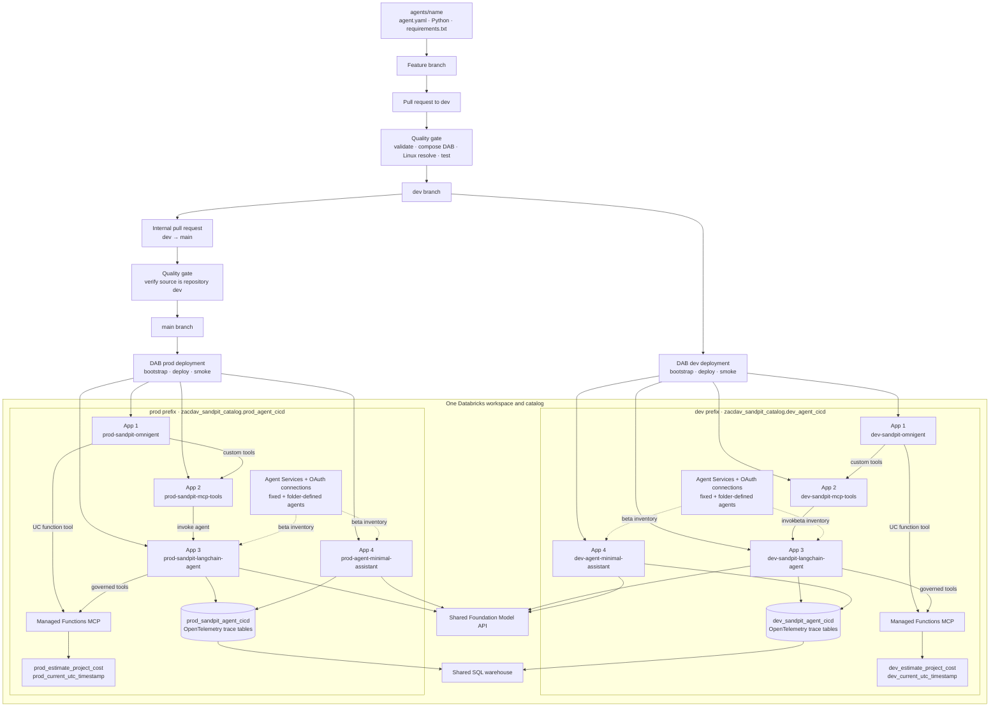

# Databricks agent CI/CD sandpit

This repository is a small, working demonstration of deploying agents and
governed tools to Databricks Apps through a Databricks Asset Bundle (now named
a Declarative Automation Bundle, or DAB) and GitHub Actions.

It deploys four app definitions per target. With both `dev` and `prod`
active, the workspace contains eight app instances:

1. `*-sandpit-langchain-agent`: a FastAPI LangChain agent using a Databricks
   Foundation Model endpoint and managed Unity Catalog function MCP servers.
2. `*-sandpit-mcp-tools`: a custom Streamable HTTP MCP server.
3. `*-sandpit-omnigent`: an Omnigent server that pre-registers a YAML supervisor
   wired to the first two apps and a managed Unity Catalog function MCP server.
4. `*-agent-minimal-assistant`: the example produced from the minimal
   folder-defined agent contract.

## Architecture



## Folder-defined agent contract

The new author surface is deliberately smaller than a Databricks App or DAB
resource. A pull request adds one directory:

```text
agents/minimal-assistant/
├── agent.yaml
├── agent.py
└── requirements.txt
```

The complete manifest has three fields:

```yaml
name: minimal-assistant
model: default
entrypoint: agent:invoke
```

The entrypoint is a synchronous or asynchronous
`invoke(message, context) -> str` function. `context` supplies the immutable
agent name, approved model endpoint and deployment target. The example is in
[`agents/minimal-assistant`](agents/minimal-assistant).

[`scripts/compose_agents.py`](scripts/compose_agents.py) validates every folder
and builds `.generated/` atomically. It injects the platform FastAPI runtime and
SDK, then emits one isolated Databricks App DAB resource per folder. Generation
is deterministic and runs before validation in CI and before every deployment.
[`scripts/validate_agent_dependencies.py`](scripts/validate_agent_dependencies.py)
uses `uv` to resolve each generated requirements file specifically for the
Databricks Linux/Python 3.11 runtime.

The platform, rather than the author, owns:

- HTTP and health routes, request limits and error handling.
- MLflow tracing and target-specific Unity Catalog trace bindings.
- App commands, names, service principals, permissions and DAB structure.
- Model endpoints through aliases in
  [`agent_platform/policy.yaml`](agent_platform/policy.yaml).
- Dev/prod naming, deployment, startup and end-to-end smoke testing.

The strictness is intentional. Unknown YAML fields, duplicate keys, arbitrary
model endpoints, symlinks, unsafe requirement directives, direct URLs and
non-exact author dependency pins fail the quality gate. Raw environment
variables, resource bindings, permissions and DAB fragments are not part of
the contract. Author dependencies use exact pins; the injected platform
runtime is also exact-pinned.

This is trusted reviewed Python, not a sandbox for untrusted pull requests.
One folder creates one App identity and scaling boundary, even if its Python
internally coordinates several logical subagents. Folder deletion or renaming
is a destructive infrastructure change. V1 blocks it in the pull-request
quality gate; an explicit retirement workflow should be added before removals
are permitted. Platform-owned surfaces also require review via CODEOWNERS. A
future capability such as tools or App dependencies should be added as a
typed, allowlisted contract version—not by exposing raw DAB YAML.

The implementation stays in this repository for v1 so the contract, runtime
and deployment behavior change atomically. Once the interface is stable, the
generator and `agent_sdk` are natural candidates for a separately versioned
platform package; moving individual agents to separate repositories before
that point would add release coordination without improving isolation.

## Unity Catalog mapping

The DAB maps each supported object at the strongest level Databricks currently
provides:

- The cost and current-time tools are three-level Unity Catalog `FUNCTION`
  securables. Both agent Apps receive `EXECUTE` through DAB
  `uc_securable` bindings and call them through Databricks-managed Functions
  MCP endpoints.
- The LangChain Apps are registered after deployment as target-specific Unity
  Catalog Agent Services. Every folder-defined agent is registered the same
  way. Agent Services are currently beta inventory and permission objects; the
  sandpit owner receives `EXECUTE` and `READ_METADATA`. Runtime invocation is
  not yet available, so live traffic continues to use each DAB-deployed App
  endpoint.
- The custom MCP remains a stateless DAB App. Databricks currently treats
  custom MCP servers hosted in Apps separately from Unity Catalog MCP Services
  and explicitly does not support registering an App as an MCP Service.
- Trace data is governed in four Unity Catalog OpenTelemetry tables.

DAB CLI `1.7.x` has no first-class resource types for UC functions, HTTP
connections, Agent Services, or MCP Services. The bundle therefore uses native
App/resource definitions plus a DAB `register_uc_agent` script for the beta
Agent Service reconciliation. That script reuses `WorkspaceClient` connection
methods and its authenticated API client, extending only the beta request paths
that the generated SDK does not expose. It does not add unsupported YAML
resource keys or manage a second HTTP authentication stack. See the current
Databricks documentation for
[managed MCP servers](https://docs.databricks.com/aws/en/agents/mcp/managed-mcp),
[Agent Services](https://docs.databricks.com/aws/en/ai-gateway/agent-services),
and [MCP Service limitations](https://docs.databricks.com/aws/en/agents/mcp/mcp-services).

## Trace storage

The workspace does not expose a writable `system.ai.mlflow_traces` table.
Current Databricks guidance uses an MLflow experiment bound to four governed,
SQL-queryable Unity Catalog OpenTelemetry tables instead:

| Target | MLflow experiment | UC schema | Table prefix |
| --- | --- | --- | --- |
| dev | `/Shared/dev-sandpit-agent-cicd-traces` | `zacdav_sandpit_catalog.dev_agent_cicd` | `dev_sandpit_agent_cicd_otel_*` |
| prod | `/Shared/prod-sandpit-agent-cicd-traces` | `zacdav_sandpit_catalog.prod_agent_cicd` | `prod_sandpit_agent_cicd_otel_*` |

Each prefix expands to `annotations`, `logs`, `metrics`, and `spans` tables.
Nothing in either target binds to the other target's schema.

The LangChain app calls `mlflow.langchain.autolog()`, sets the bundle-bound
experiment, and discovers both governed tools through managed MCP before
building the agent. The end-to-end smoke test invokes the agent and waits until
a row is visible in the spans table.

## Omnigent behavior

The agent definition is
[`src/omnigent_app/sandpit_supervisor/config.yaml`](src/omnigent_app/sandpit_supervisor/config.yaml).
It demonstrates:

- A remote custom MCP server with Databricks OAuth.
- A governed Unity Catalog function exposed through Databricks' managed
  function MCP endpoint.
- An Omnigent subagent that calls the deployed LangChain API through the
  custom MCP bridge and returns the downstream MLflow trace ID.
- A policy that returns `ASK` before `sys_session_send` or
  `sys_session_create`.
- A small custom policy that returns `ASK` whenever cumulative Omnigent spend
  reaches a new whole-dollar checkpoint.

Omnigent evaluates spend at turn/tool boundaries. If one turn jumps across
several dollar checkpoints, it asks once at the highest newly crossed
checkpoint. The policy measures Omnigent LLM spend; spend inside the downstream
LangChain app is traced separately by MLflow.

Databricks Apps currently supplies Python 3.11, while Omnigent 0.6 requires
Python 3.12. The launcher uses `uvx` to create an isolated Python 3.12 runtime;
the Omnigent version and application definition remain bundle-controlled.
This sandpit instance uses Omnigent's local single-user mode and grants the
Omnigent app only to `zachary.davies@databricks.com`. A multi-user rollout
should replace that mode with Omnigent shared-server SSO.

## Local deployment

Prerequisites:

- Python 3.12+
- `uv` 0.11.16+
- Databricks CLI
- `jq`
- A valid `sandpit` profile
- OAuth M2M credentials in `DATABRICKS_CLIENT_ID` and
  `DATABRICKS_CLIENT_SECRET` when creating either target's Agent Service
  connection for the first time

Create a virtual environment and install the deployment dependencies:

```bash
uv venv --python 3.12 .venv
uv pip install --python .venv/bin/python \
  -r requirements-ci.txt \
  -r src/langchain_agent/requirements.txt \
  -r src/mcp_server/requirements.txt
python scripts/compose_agents.py
python scripts/validate_agent_dependencies.py
```

Deploy and run all checks:

```bash
bash scripts/deploy_local.sh dev
```

The bootstrap step is idempotent. It creates the selected target's schema,
creates or updates its two UC functions, and upserts its MLflow experiment
before the bundle adds target-scoped App resource bindings.

## GitHub Actions

The workflow in [`.github/workflows/ci-cd.yml`](.github/workflows/ci-cd.yml)
uses a pinned `uv` release and its dependency cache for fast, reproducible
environment creation:

1. A feature pull request targets `dev` and must pass the quality gate.
2. A push to `dev` bootstraps only `dev_agent_cicd`, deploys the four current
   `dev-` Apps, reconciles the dev Agent Service, and runs the full smoke test.
3. Production requires an internal pull request from the repository's `dev`
   branch to `main`. A dedicated check rejects every other source branch,
   including a fork branch also named `dev`.
4. After that pull request merges, the `main` push is checked against its
   associated merged promotion before CI bootstraps and deploys only `prod`.

There is no manual-dispatch production path. Repository protection requires a
pull request and the named checks on both branches, blocks force pushes and
deletion, and applies to administrators. `dev` is the repository's default
branch, so ordinary changes naturally enter the development environment first.

Both deployment jobs use the existing `production` GitHub environment for
credentials in this sandpit:

- Variable `DATABRICKS_HOST`
- Secret `DATABRICKS_CLIENT_ID`
- Secret `DATABRICKS_CLIENT_SECRET`

The credentials belong to a dedicated Databricks service principal and are
used with OAuth M2M. No PAT, local profile, or secret is committed.
`register_uc_agent.py` reads the same resolved credentials from
`WorkspaceClient.config` to seed the target-specific OAuth connection. Reusing
the deployment principal is acceptable for this isolated proof; production
should provision a dedicated, non-admin agent-caller principal and rotate its
connection secret independently.

Both targets use the same Databricks workspace, catalog, warehouse, and model
endpoint. They do not share schemas, functions, MLflow experiments, trace
tables, App names, Agent Services, connections, or bundle root paths. Every
target-specific resource uses an explicit `dev` or `prod` prefix. The shared
GitHub credential environment can be split later without changing the DAB.

The workspace IP ACL rejects ephemeral GitHub-hosted addresses, so only the
two deployment jobs use a repository-scoped, `sandpit-deploy` self-hosted
runner on an authorized network. Pull-request tests remain on GitHub-hosted
runners. The runner is installed as a macOS launch service on the sandpit
machine and has Homebrew Python 3.12 available as `python3.12`. The hosted test
job publishes a one-day macOS wheelhouse artifact, allowing the
network-restricted deploy runner to install its small deployment dependency set
without reaching PyPI.

The Databricks Apps run on Databricks' Linux runtime. Only the CI deployment
client currently runs on macOS because that is the sole ACL-authorized
self-hosted runner. When an authorized Linux runner is registered, change the
two `runs-on` labels and wheelhouse platform together.

For this isolated proof, the CI service principal is a workspace administrator
so it can idempotently bootstrap governed resources. A production rollout
should replace that broad role with explicit catalog, experiment, app, and
warehouse grants after the platform team has fixed the target namespaces.

## Useful commands

```bash
databricks bundle validate -t dev --var experiment_id=<id>
databricks bundle deploy -t dev --var experiment_id=<id>
databricks bundle run register_uc_agent -t dev --var experiment_id=<id>
databricks bundle run smoke_test -t dev --var experiment_id=<id>
databricks apps logs dev-sandpit-langchain-agent -p sandpit
databricks apps logs dev-sandpit-mcp-tools -p sandpit
databricks apps logs dev-sandpit-omnigent -p sandpit
databricks apps logs dev-agent-minimal-assistant -p sandpit
```

## Main source files

- [`databricks.yml`](databricks.yml): bundle variables and targets.
- [`resources/apps.yml`](resources/apps.yml): the three app resources and
  least-privilege bindings.
- [`agents/`](agents): minimal author-owned agent folders.
- [`agent_platform/`](agent_platform): model policy and injected App runtime.
- [`scripts/compose_agents.py`](scripts/compose_agents.py): strict contract
  validation and deterministic DAB composition.
- [`src/langchain_agent/agent.py`](src/langchain_agent/agent.py): LangChain and
  MLflow tracing.
- [`src/mcp_server/server.py`](src/mcp_server/server.py): custom MCP tools.
- [`scripts/bootstrap_resources.py`](scripts/bootstrap_resources.py): ordered,
  idempotent resource bootstrap.
- [`scripts/register_uc_agent.py`](scripts/register_uc_agent.py): idempotent
  beta Agent Service inventory registration.
- [`scripts/deploy_target.sh`](scripts/deploy_target.sh): shared deployment and
  smoke-test sequence for either bundle target.
- [`scripts/smoke_test.py`](scripts/smoke_test.py): deployment acceptance test.
