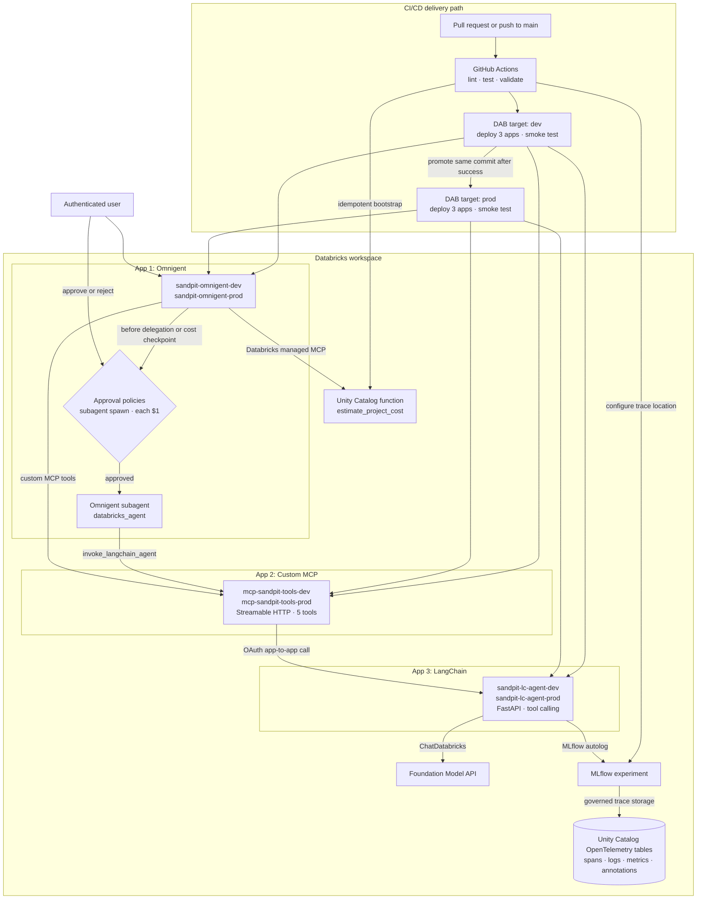

# Databricks agent CI/CD sandpit

This repository is a small, working demonstration of deploying agents and tools
to Databricks Apps through a Databricks Asset Bundle and GitHub Actions.

It deploys three app definitions per target. With both `dev` and `prod`
active, the workspace contains six app instances:

1. `sandpit-lc-agent-*`: a FastAPI LangChain agent using a Databricks
   Foundation Model endpoint.
2. `mcp-sandpit-tools-*`: a custom Streamable HTTP MCP server.
3. `sandpit-omnigent-*`: an Omnigent server that pre-registers a YAML supervisor
   wired to the first two apps and a Unity Catalog function.

## Architecture



## Trace storage

The workspace does not expose a writable `system.ai.mlflow_traces` table.
Current Databricks guidance uses an MLflow experiment bound to four governed,
SQL-queryable Unity Catalog OpenTelemetry tables instead:

- `zacdav_sandpit_catalog.default.sandpit_agent_cicd_otel_annotations`
- `zacdav_sandpit_catalog.default.sandpit_agent_cicd_otel_logs`
- `zacdav_sandpit_catalog.default.sandpit_agent_cicd_otel_metrics`
- `zacdav_sandpit_catalog.default.sandpit_agent_cicd_otel_spans`

The LangChain app calls `mlflow.langchain.autolog()` and sets the bundle-bound
experiment before building the agent. The end-to-end smoke test invokes the
agent and waits until a row is visible in the spans table.

## Omnigent behavior

The agent definition is
[`src/omnigent_app/sandpit_supervisor/config.yaml`](src/omnigent_app/sandpit_supervisor/config.yaml).
It demonstrates:

- A remote custom MCP server with Databricks OAuth.
- A governed Unity Catalog function exposed through Databricks' managed
  function MCP endpoint.
- An Omnigent subagent that calls the deployed LangChain API through the
  custom MCP bridge and returns the downstream MLflow trace ID.
- A policy that returns `ASK` before `sys_session_send` or
  `sys_session_create`.
- A small custom policy that returns `ASK` whenever cumulative Omnigent spend
  reaches a new whole-dollar checkpoint.

Omnigent evaluates spend at turn/tool boundaries. If one turn jumps across
several dollar checkpoints, it asks once at the highest newly crossed
checkpoint. The policy measures Omnigent LLM spend; spend inside the downstream
LangChain app is traced separately by MLflow.

Databricks Apps currently supplies Python 3.11, while Omnigent 0.6 requires
Python 3.12. The launcher uses `uvx` to create an isolated Python 3.12 runtime;
the Omnigent version and application definition remain bundle-controlled.
This sandpit instance uses Omnigent's local single-user mode and grants the
Omnigent app only to `zachary.davies@databricks.com`. A multi-user rollout
should replace that mode with Omnigent shared-server SSO.

## Local deployment

Prerequisites:

- Python 3.12+
- Databricks CLI
- `jq`
- A valid `sandpit` profile

Create a virtual environment and install the deployment dependencies:

```bash
python3.12 -m venv .venv
.venv/bin/pip install \
  -r requirements-ci.txt \
  -r src/langchain_agent/requirements.txt \
  -r src/mcp_server/requirements.txt
```

Deploy and run all checks:

```bash
bash scripts/deploy_local.sh dev
```

The bootstrap step is idempotent. It creates or updates the UC function and
upserts the MLflow experiment with its Unity Catalog trace location before the
bundle adds app resource bindings.

## GitHub Actions

The workflow in [`.github/workflows/ci-cd.yml`](.github/workflows/ci-cd.yml):

1. Lints, tests, and parses the Omnigent YAML on every pull request.
2. Bootstraps the trace tables and UC function on `main`.
3. Validates and deploys the `dev` bundle target, starts its three apps, and
   runs the complete smoke test.
4. Promotes the same commit to the `prod` target only after development
   succeeds, then starts and smoke-tests the three production apps.

The `production` GitHub environment needs:

- Variable `DATABRICKS_HOST`
- Secret `DATABRICKS_CLIENT_ID`
- Secret `DATABRICKS_CLIENT_SECRET`

The credentials belong to a dedicated Databricks service principal and are
used with OAuth M2M. No PAT, local profile, or secret is committed.

Both targets currently use the same Databricks workspace, catalog, warehouse,
MLflow experiment, and UC function. Bundle target suffixes and root paths keep
the six app deployments and their deployment state separate. The two GitHub
jobs also share the existing `production` environment credentials for this
sandpit; they can be mapped to separate workspaces and GitHub environments
later without changing the app definitions.

The workspace IP ACL rejects ephemeral GitHub-hosted addresses, so only the
two deployment jobs use a repository-scoped, `sandpit-deploy` self-hosted
runner on an authorized network. Pull-request tests remain on GitHub-hosted
runners. The runner is installed as a macOS launch service on the sandpit
machine and has Homebrew Python 3.12 available as `python3.12`. The hosted test
job publishes a one-day macOS wheelhouse artifact, allowing the
network-restricted deploy runner to install its small deployment dependency set
without reaching PyPI.

For this isolated proof, the CI service principal is a workspace administrator
so it can idempotently bootstrap governed resources. A production rollout
should replace that broad role with explicit catalog, experiment, app, and
warehouse grants after the platform team has fixed the target namespaces.

## Useful commands

```bash
databricks bundle validate -t dev --var experiment_id=<id>
databricks bundle deploy -t dev --var experiment_id=<id>
databricks apps logs sandpit-lc-agent-dev -p sandpit
databricks apps logs mcp-sandpit-tools-dev -p sandpit
databricks apps logs sandpit-omnigent-dev -p sandpit
```

## Main source files

- [`databricks.yml`](databricks.yml): bundle variables and targets.
- [`resources/apps.yml`](resources/apps.yml): the three app resources and
  least-privilege bindings.
- [`src/langchain_agent/agent.py`](src/langchain_agent/agent.py): LangChain and
  MLflow tracing.
- [`src/mcp_server/server.py`](src/mcp_server/server.py): custom MCP tools.
- [`scripts/bootstrap_resources.py`](scripts/bootstrap_resources.py): ordered,
  idempotent resource bootstrap.
- [`scripts/deploy_target.sh`](scripts/deploy_target.sh): shared deployment and
  smoke-test sequence for either bundle target.
- [`scripts/smoke_test.py`](scripts/smoke_test.py): deployment acceptance test.
