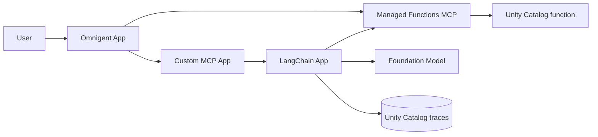
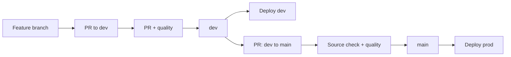
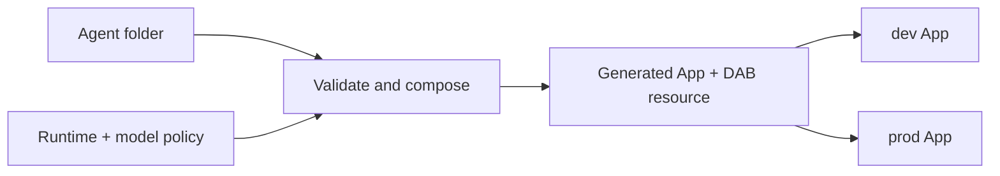

# Databricks agent CI/CD sandpit

A working reference for deploying agents and governed tools to Databricks Apps
with a Databricks Asset Bundle (DAB) and GitHub Actions.

It proves three things:

1. A LangChain agent, custom MCP server, and Omnigent supervisor can work
   together as separate Databricks Apps.
2. Changes can move through protected `dev` and `main` branches before DAB
   deployment to isolated dev and prod namespaces.
3. An author can add a new agent with one small folder while the platform
   generates the App runtime, DAB resource, permissions, tracing, and CI/CD.

## Start here

To add an agent, create one folder:

```text
agents/my-agent/
├── agent.yaml
├── agent.py
└── requirements.txt
```

The manifest is only:

```yaml
name: my-agent
model: default
entrypoint: agent:invoke
```

The entrypoint receives a message and platform context:

```python
from agent_sdk import AgentContext


async def invoke(message: str, context: AgentContext) -> str:
    return f"{context.name} received: {message}"
```

After completing the
[local setup](docs/operations/deployment.md#setup), run the contract checks:

```bash
python scripts/compose_agents.py
python scripts/validate_agent_dependencies.py
pytest
```

Then open a pull request to `dev`. The pull request must pass the quality gate
before the agent can deploy. CODEOWNERS marks platform-owned surfaces, but
independent approval is advisory while this sandpit has only one collaborator.

See the [agent author guide](agents/README.md) for the exact rules and the
[minimal example](agents/minimal-assistant).

## Architecture

The repository is easier to understand as three separate views.

### 1. Runtime example

The original example connects three Apps with a managed Unity Catalog tool
surface. The LangChain App owns model calls and MLflow tracing.



[Runtime architecture and governance details](docs/architecture/runtime-example.md)

### 2. GitHub Actions and promotion

CI/CD is a branch promotion flow. Production is reachable only from the
repository's `dev` branch.



[CI/CD, authentication, runner, and isolation details](docs/architecture/cicd.md)

### 3. Folder-defined agent contract

The author supplies code and three manifest fields. The platform composes the
deployable App and DAB resource.



[Contract, generated runtime, and validation details](docs/architecture/folder-defined-agents.md)

## What is deployed

Each target currently has four App definitions:

| App | Role |
| --- | --- |
| `*-sandpit-langchain-agent` | LangChain agent with managed UC function tools and MLflow tracing. |
| `*-sandpit-mcp-tools` | Custom Streamable HTTP MCP server. |
| `*-sandpit-omnigent` | Policy-controlled Omnigent supervisor. |
| `*-agent-minimal-assistant` | Example generated from an agent folder. |

Dev and prod use the same sandpit workspace but have different App names,
schemas, functions, experiments, trace tables, Agent Services, and bundle
paths.

## Repository map

| Path | Purpose |
| --- | --- |
| [`agents/`](agents) | Minimal author-owned agent folders. |
| [`agent_sdk/`](agent_sdk) | Stable context passed to agent entrypoints. |
| [`agent_platform/`](agent_platform) | Platform model policy and injected App runtime. |
| [`scripts/compose_agents.py`](scripts/compose_agents.py) | Strict contract validation and deterministic DAB composition. |
| [`resources/apps.yml`](resources/apps.yml) | The three explicit example App resources. |
| [`src/`](src) | LangChain, custom MCP, and Omnigent implementations. |
| [`databricks.yml`](databricks.yml) | DAB variables, scripts, and dev/prod targets. |
| [`.github/workflows/ci-cd.yml`](.github/workflows/ci-cd.yml) | Quality, promotion, and deployment workflow. |

## More documentation

- [Documentation index](docs/README.md)
- [Local development and deployment](docs/operations/deployment.md)
- [Runtime example](docs/architecture/runtime-example.md)
- [CI/CD flow](docs/architecture/cicd.md)
- [Folder-defined agents](docs/architecture/folder-defined-agents.md)
