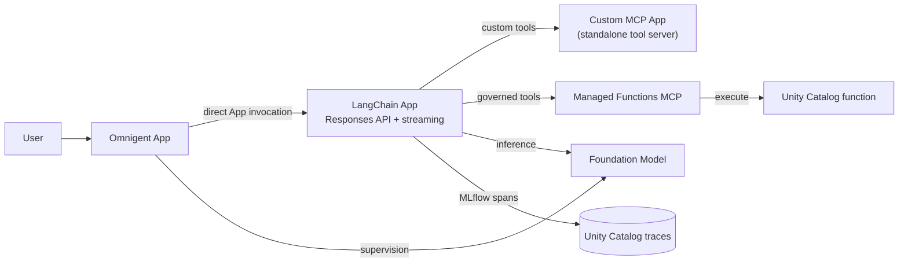
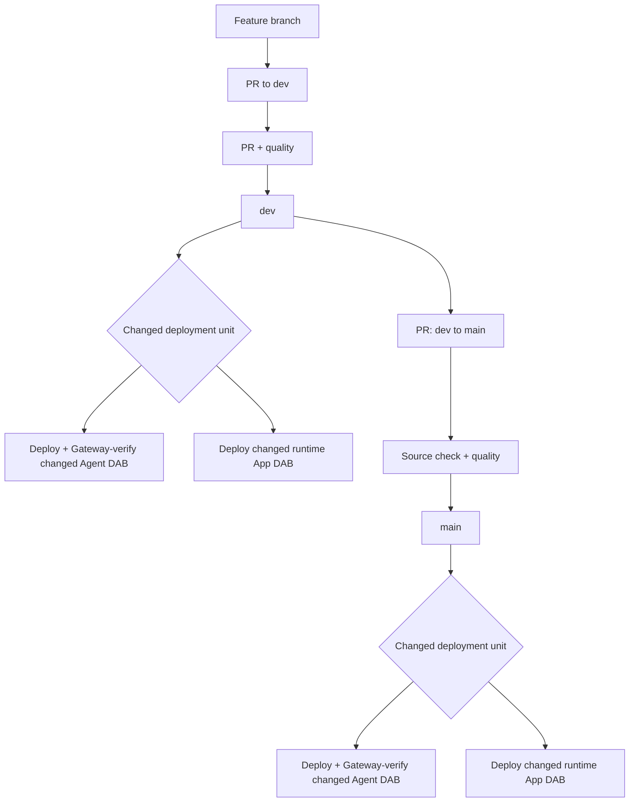
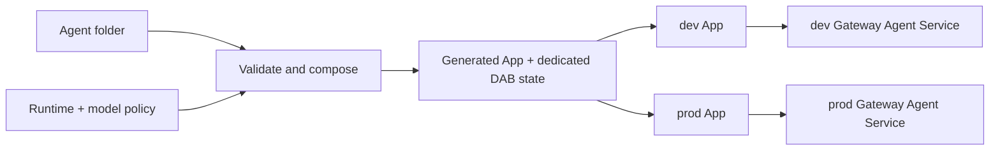

# Databricks agent CI/CD sandpit

A working reference for deploying agents and governed tools to
[Databricks Apps](https://docs.databricks.com/aws/en/dev-tools/databricks-apps/)
with
[Declarative Automation Bundles](https://docs.databricks.com/aws/en/dev-tools/bundles/)
(DABs, formerly Databricks Asset Bundles) and
[GitHub Actions](https://docs.databricks.com/aws/en/dev-tools/ci-cd/github).

This repository is an example of how teams can:

- Build agents on Databricks, deploy them through Databricks Apps, and register
  every deployed agent in
  [Unity AI Gateway](https://docs.databricks.com/aws/en/ai-gateway/) as a
  governed
  [Unity Catalog Agent Service](https://docs.databricks.com/aws/en/ai-gateway/agent-services).
- Promote applications and agents through a protected dev-to-prod process
  using GitHub Actions and DABs.
- Offer a centrally managed deployment path where authors add a small agent
  folder and inherit the App runtime, DAB resources, permissions, tracing,
  validation, and CI/CD.

## Start here

To add an agent, create one folder:

```text
agents/my-agent/
├── agent.yaml
├── agent.py
└── requirements.txt
```

The manifest is only:

```yaml
name: my-agent
model: default
entrypoint: agent:invoke
```

The entrypoint is one ordinary Python function. It has no platform SDK
dependency:

```python
def invoke(message: str) -> str:
    return f"Received: {message}"
```

For true streaming, add the optional companion function. It may return a
synchronous or asynchronous iterator:

```python
def invoke_stream(message: str):
    yield "Received: "
    yield message
```

The function may call an existing LangChain, OpenAI Agents SDK, or custom
agent. The platform normalizes only this invocation boundary and supplies the
approved
[Foundation Model API](https://docs.databricks.com/aws/en/machine-learning/foundation-model-apis)
endpoint as `MODEL_ENDPOINT`.

Every agent is served through the
[MLflow Responses API](https://docs.databricks.com/aws/en/agents/custom-agents/author-agent)
at `/responses`. With `"stream": true`, clients receive standard Server-Sent
Events as the underlying implementation produces tokens. The original
`/api/invocations` route remains as a compatibility endpoint.

The generated runtime also enables supported MLflow provider integrations
before it imports the author module, so model calls become child spans without
an author-side tracing dependency. See
[platform-owned tracing](docs/architecture/platform-tracing.md).

After completing the
[local setup](docs/operations/deployment.md#setup), run the contract checks:

```bash
python scripts/compose_agents.py
python scripts/validate_agent_dependencies.py
pytest
```

Then open a pull request to `dev`. The pull request must pass the quality gate
before the agent can deploy. CODEOWNERS marks platform-owned surfaces, but
independent approval is advisory while this sandpit has only one collaborator.

See the [agent author guide](agents/README.md) for the exact rules and the
[LangChain example](agents/langchain-assistant).

The repository also includes framework and provider examples with the same
contract:

| Example | Client | Managed model |
| --- | --- | --- |
| [LangChain](agents/langchain-assistant) | `ChatDatabricks` | `databricks-claude-sonnet-4-5` |
| [Gemini](agents/gemini-assistant) | Google Gen AI SDK | `databricks-gemini-3-1-flash-lite` |
| [Claude](agents/claude-assistant) | Anthropic SDK | `databricks-claude-haiku-4-5` |
| [OpenAI](agents/openai-assistant) | Databricks OpenAI client | `databricks-gpt-5-mini` |

## Architecture

The repository is easier to understand as three separate views.

### Runtime example

The original example connects three Databricks Apps. Omnigent delegates to
LangChain, and LangChain uses both the custom MCP App and a
[Databricks managed MCP server](https://docs.databricks.com/aws/en/agents/mcp/managed-mcp)
over Unity Catalog functions. The LangChain App owns the downstream agent's
model call, tool selection, and
[MLflow Tracing](https://docs.databricks.com/aws/en/mlflow3/genai/tracing/).
Omnigent uses the same foundation-model endpoint for supervision and
delegation.



The custom MCP has no outbound agent dependency: LangChain is its client.

[Runtime architecture and governance details](docs/architecture/runtime-example.md)

### GitHub Actions and promotion

CI/CD is a branch promotion flow. Production is reachable only from the
repository's `dev` branch.



[CI/CD, authentication, runner, and isolation details](docs/architecture/cicd.md)

### Folder-defined agent contract

The author supplies code and three manifest fields. The platform composes the
deployable App and a dedicated DAB. Agent folders never share deployment
state.



[Contract, generated runtime, and validation details](docs/architecture/folder-defined-agents.md)

## What is deployed

Each target currently has seven App definitions:

| App | Role |
| --- | --- |
| `*-sandpit-langchain-agent` | Streaming LangChain agent with the custom MCP App, [managed Unity Catalog function tools](https://docs.databricks.com/aws/en/agents/mcp/managed-mcp#unity-catalog-functions), and MLflow tracing. |
| `mcp-*-sandpit-tools` | Custom [Model Context Protocol (MCP)](https://docs.databricks.com/aws/en/agents/mcp/custom-mcp) server, named with the required `mcp-` prefix for AI Playground discovery. |
| `*-sandpit-omnigent` | Policy-controlled [Omnigent](https://omnigent.ai/docs/use/custom-agents) supervisor that delegates directly to the LangChain App. |
| `*-agent-langchain-assistant` | Folder agent using LangChain `ChatDatabricks`. |
| `*-agent-gemini-assistant` | Folder agent using the native Google Gen AI SDK. |
| `*-agent-claude-assistant` | Folder agent using the native Anthropic SDK. |
| `*-agent-openai-assistant` | Folder agent using the OpenAI SDK surface. |

Dev and prod use the same sandpit workspace but have different App names,
schemas, functions, experiments, trace tables,
[Agent Services in Unity Catalog](https://docs.databricks.com/aws/en/ai-gateway/agent-services),
and bundle paths.

Every LangChain, Omnigent, and folder-defined agent App is registered in
[Unity AI Gateway](https://docs.databricks.com/aws/en/ai-gateway/) after its
DAB deploys. CI reads the Agent Service and grants back from the API and fails
the deployment unless the App connection, base path, `EXECUTE`, and
`READ_METADATA` match the platform contract.

## Repository map

| Path | Purpose |
| --- | --- |
| [`agents/`](agents) | Minimal author-owned agent folders. |
| [`agent_platform/`](agent_platform) | Platform model policy and injected App runtime. |
| [`examples/external-agent/`](examples/external-agent) | The same platform tracing boundary on compute hosted outside Databricks. |
| [`scripts/compose_agents.py`](scripts/compose_agents.py) | Strict contract validation and deterministic DAB composition. |
| [`src/`](src) | LangChain, custom MCP, and Omnigent implementations, each with its own DAB. |
| [`.github/workflows/ci-cd.yml`](.github/workflows/ci-cd.yml) | Quality, promotion, and deployment workflow. |

## More documentation

- [Documentation index](docs/README.md)
- [Local development and deployment](docs/operations/deployment.md)
- [Runtime example](docs/architecture/runtime-example.md)
- [CI/CD flow](docs/architecture/cicd.md)
- [Folder-defined agents](docs/architecture/folder-defined-agents.md)
- [Platform-owned tracing and external hosting](docs/architecture/platform-tracing.md)
