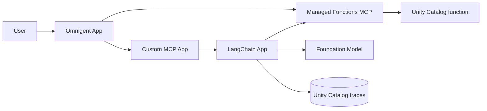
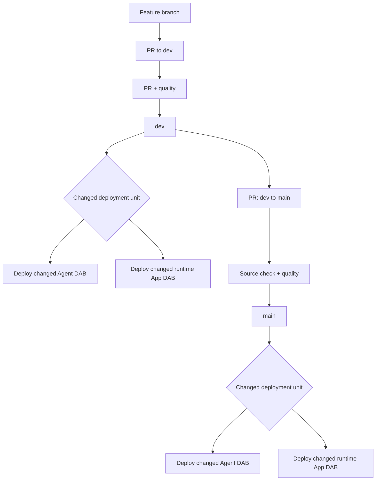
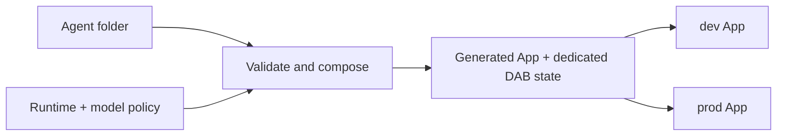

# Databricks agent CI/CD sandpit

A working reference for deploying agents and governed tools to Databricks Apps
with a Databricks Asset Bundle (DAB) and GitHub Actions.

This repository is an example of how teams can:

- Build agents on Databricks, deploy them through Databricks Apps, and register
  the deployed agents and governed tools in Unity Catalog.
- Promote applications and agents through a protected dev-to-prod process
  using GitHub Actions and DABs.
- Offer a centrally managed deployment path where authors add a small agent
  folder and inherit the App runtime, DAB resources, permissions, tracing,
  validation, and CI/CD.

## Start here

To add an agent, create one folder:

```text
agents/my-agent/
├── agent.yaml
├── agent.py
└── requirements.txt
```

The manifest is only:

```yaml
name: my-agent
model: default
entrypoint: agent:invoke
```

The entrypoint is one ordinary Python function. It has no platform SDK
dependency:

```python
def invoke(message: str) -> str:
    return f"Received: {message}"
```

The function may call an existing LangChain, OpenAI Agents SDK, or custom
agent. The platform normalizes only this invocation boundary and supplies the
approved model endpoint as `MODEL_ENDPOINT`.

After completing the
[local setup](docs/operations/deployment.md#setup), run the contract checks:

```bash
python scripts/compose_agents.py
python scripts/validate_agent_dependencies.py
pytest
```

Then open a pull request to `dev`. The pull request must pass the quality gate
before the agent can deploy. CODEOWNERS marks platform-owned surfaces, but
independent approval is advisory while this sandpit has only one collaborator.

See the [agent author guide](agents/README.md) for the exact rules and the
[minimal example](agents/minimal-assistant).

The repository also includes provider-native examples with the same contract:

| Example | Client | Managed model |
| --- | --- | --- |
| [Gemini](agents/gemini-assistant) | Google Gen AI SDK | `databricks-gemini-3-1-flash-lite` |
| [Claude](agents/claude-assistant) | Anthropic SDK | `databricks-claude-haiku-4-5` |
| [OpenAI](agents/openai-assistant) | Databricks OpenAI client | `databricks-gpt-5-mini` |

## Architecture

The repository is easier to understand as three separate views.

### Runtime example

The original example connects three Apps with a managed Unity Catalog tool
surface. The LangChain App owns model calls and MLflow tracing.



[Runtime architecture and governance details](docs/architecture/runtime-example.md)

### GitHub Actions and promotion

CI/CD is a branch promotion flow. Production is reachable only from the
repository's `dev` branch.



[CI/CD, authentication, runner, and isolation details](docs/architecture/cicd.md)

### Folder-defined agent contract

The author supplies code and three manifest fields. The platform composes the
deployable App and a dedicated DAB. Agent folders never share deployment
state.



[Contract, generated runtime, and validation details](docs/architecture/folder-defined-agents.md)

## What is deployed

Each target currently has seven App definitions:

| App | Role |
| --- | --- |
| `*-sandpit-langchain-agent` | LangChain agent with managed UC function tools and MLflow tracing. |
| `*-sandpit-mcp-tools` | Custom Streamable HTTP MCP server. |
| `*-sandpit-omnigent` | Policy-controlled Omnigent supervisor. |
| `*-agent-minimal-assistant` | Example generated from an agent folder. |
| `*-agent-gemini-assistant` | Folder agent using the native Google Gen AI SDK. |
| `*-agent-claude-assistant` | Folder agent using the native Anthropic SDK. |
| `*-agent-openai-assistant` | Folder agent using the OpenAI SDK surface. |

Dev and prod use the same sandpit workspace but have different App names,
schemas, functions, experiments, trace tables, Agent Services, and bundle
paths.

## Repository map

| Path | Purpose |
| --- | --- |
| [`agents/`](agents) | Minimal author-owned agent folders. |
| [`agent_platform/`](agent_platform) | Platform model policy and injected App runtime. |
| [`scripts/compose_agents.py`](scripts/compose_agents.py) | Strict contract validation and deterministic DAB composition. |
| [`src/`](src) | LangChain, custom MCP, and Omnigent implementations, each with its own DAB. |
| [`.github/workflows/ci-cd.yml`](.github/workflows/ci-cd.yml) | Quality, promotion, and deployment workflow. |

## More documentation

- [Documentation index](docs/README.md)
- [Local development and deployment](docs/operations/deployment.md)
- [Runtime example](docs/architecture/runtime-example.md)
- [CI/CD flow](docs/architecture/cicd.md)
- [Folder-defined agents](docs/architecture/folder-defined-agents.md)
