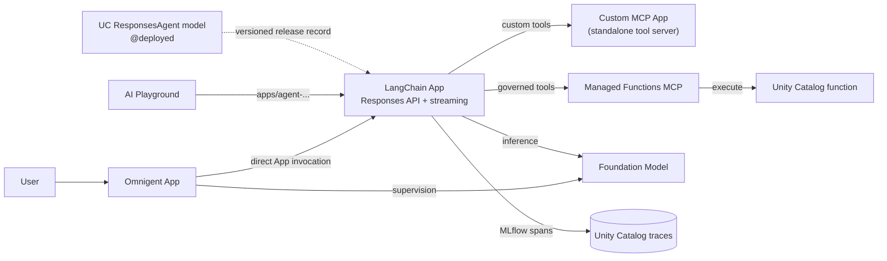
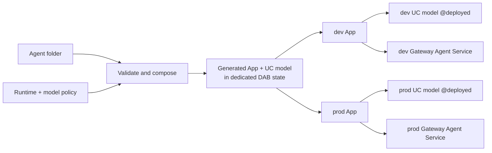

# Databricks agent CI/CD sandpit

A working reference for deploying agents and governed tools to
[Databricks Apps](https://docs.databricks.com/aws/en/dev-tools/databricks-apps/)
with
[Declarative Automation Bundles](https://docs.databricks.com/aws/en/dev-tools/bundles/)
(DABs, formerly Databricks Asset Bundles) and
[GitHub Actions](https://docs.databricks.com/aws/en/dev-tools/ci-cd/github).

This repository is an example of how teams can:

- Build agents on Databricks, deploy them through Databricks Apps, and register
  every deployed agent both as a versioned
  [Unity Catalog model](https://docs.databricks.com/aws/en/machine-learning/manage-model-lifecycle/)
  and in
  [Unity AI Gateway](https://www.databricks.com/blog/unity-ai-gateway-generally-available)
  as a
  governed
  [Unity Catalog Agent Service](https://docs.databricks.com/aws/en/ai-gateway/agent-services).
- Promote applications and agents through a protected dev-to-prod process
  using GitHub Actions and DABs.
- Offer a centrally managed deployment path where authors add a small agent
  folder and inherit the App runtime, DAB resources, permissions, tracing,
  validation, and CI/CD.

## Start here

To add an agent, create one folder:

```text
agents/my-agent/
├── agent.yaml
├── agent.py
└── requirements.txt
```

The manifest is only:

```yaml
name: my-agent
model: default
entrypoint: agent:invoke
```

The entrypoint is one ordinary Python function. It has no platform SDK
dependency:

```python
def invoke(message: str) -> str:
    return f"Received: {message}"
```

For true streaming, add the optional companion function. It may return a
synchronous or asynchronous iterator:

```python
def invoke_stream(message: str):
    yield "Received: "
    yield message
```

The function may call an existing LangChain, OpenAI Agents SDK, or custom
agent. The platform normalizes only this invocation boundary and supplies the
approved
[Foundation Model API](https://docs.databricks.com/aws/en/machine-learning/foundation-model-apis)
endpoint as `MODEL_ENDPOINT`.

Every agent is served through the
[MLflow Responses API](https://docs.databricks.com/aws/en/agents/custom-agents/author-agent)
at `/responses`. With `"stream": true`, clients receive standard Server-Sent
Events as the underlying implementation produces tokens. The original
`/api/invocations` route remains as a compatibility endpoint.

ResponsesAgent App names begin with `agent-`, matching the
[Databricks Apps agent convention](https://docs.databricks.com/aws/en/getting-started/gen-ai-llm-agent#step-3-export-your-agent).
CI also reads `/agent/info` and requires the `responses` agent API before a
deployment succeeds. Each agent DAB also owns a
[registered model resource](https://docs.databricks.com/aws/en/dev-tools/bundles/resources#registered-model).
After the App passes its smoke test, CI logs an MLflow ResponsesAgent model
version, points its `deployed` alias at that version, and verifies its standard
signature, streaming flag, App dependency, and commit provenance. This makes
the release discoverable and versioned in Unity Catalog. It does not create an
online endpoint or a Playground selector entry.

The online agent identity is the App itself: `apps/<app-name>`. Its `agent-`
name, `/agent/info` metadata, `/responses` API, supported signature, and
`CAN_USE` permission are the
[AI Playground-compatible App contract](https://docs.databricks.com/aws/en/agents/custom-agents/author-agent).
Inference still runs only on the Databricks App; no Model Serving endpoint is
created. The DAB grants the configured sandpit user `EXECUTE` on the model;
App `users` permissions remain a separate workspace-level control.

The generated runtime also enables supported MLflow provider integrations
before it imports the author module, so model calls become child spans without
an author-side tracing dependency. See
[platform-owned tracing](docs/architecture/platform-tracing.md).

After completing the
[local setup](docs/operations/deployment.md#setup), run the contract checks:

```bash
python scripts/compose_agents.py
python scripts/validate_agent_dependencies.py
pytest
```

Then open a pull request to `dev`. The pull request must pass the quality gate
before the agent can deploy. CODEOWNERS marks platform-owned surfaces, but
independent approval is advisory while this sandpit has only one collaborator.

See the [agent author guide](agents/README.md) for the exact rules and the
[LangChain example](agents/langchain-assistant).

The repository also includes framework and provider examples with the same
contract:

| Example | Client | Managed model |
| --- | --- | --- |
| [LangChain](agents/langchain-assistant) | `ChatDatabricks` | `databricks-claude-sonnet-4-5` |
| [Gemini](agents/gemini-assistant) | Google Gen AI SDK | `databricks-gemini-3-1-flash-lite` |
| [Claude](agents/claude-assistant) | Anthropic SDK | `databricks-claude-haiku-4-5` |
| [OpenAI](agents/openai-assistant) | Databricks OpenAI client | `databricks-gpt-5-mini` |

## Architecture

The repository is easier to understand as three separate views.

### Runtime example

The original example connects three Databricks Apps. Omnigent delegates to
LangChain, and LangChain uses both the custom MCP App and a
[Databricks managed MCP server](https://docs.databricks.com/aws/en/agents/mcp/managed-mcp)
over Unity Catalog functions. The LangChain App owns the downstream agent's
model call, tool selection, and
[MLflow Tracing](https://docs.databricks.com/aws/en/mlflow3/genai/tracing/).
Omnigent uses the same foundation-model endpoint for supervision and
delegation.



The custom MCP has no outbound agent dependency: LangChain is its client.

[Runtime architecture and governance details](docs/architecture/runtime-example.md)

### How a change reaches production

Pull requests validate code but never deploy it. A merge to `dev` releases the
changed units to the development namespace. Only that successfully tested
`dev` branch can open the promotion pull request to `main`; merging it releases
the same repository state to the production namespace.

```mermaid
flowchart LR
    Change["Change an agent or runtime App"]

    subgraph Review["Review"]
        DevPR["Pull request to dev"]
        Quality["Compose, lint, test,<br/>resolve Linux dependencies"]
    end

    subgraph Development["Development release"]
        DevCommit["Merge to dev"]
        DevSelect{"Which deployment<br/>units changed?"}
        DevRelease["For each selected unit:<br/>validate DAB → deploy → start"]
        DevProof["Verify Gateway + UC model alias<br/>and smoke streaming + traces"]
    end

    subgraph Promotion["Production guard"]
        ProdPR["Pull request<br/>dev → main"]
        SourceGuard["Require repository dev as source<br/>and repeat quality gate"]
    end

    subgraph Production["Production release"]
        MainCommit["Merge the reviewed repository state<br/>to main"]
        ProdSelect{"Select units in the<br/>promoted commit range"}
        ProdRelease["For each selected unit:<br/>validate DAB → deploy → start"]
        ProdProof["Verify Gateway + UC model alias<br/>and smoke streaming + traces"]
    end

    Change --> DevPR --> Quality
    Quality -->|"merge"| DevCommit
    DevCommit --> DevSelect --> DevRelease --> DevProof
    DevProof --> ProdPR --> SourceGuard
    SourceGuard -->|"merge reviewed state"| MainCommit
    MainCommit --> ProdSelect --> ProdRelease --> ProdProof
```



This separates three concerns:

- **Quality:** every pull request composes all agent definitions and runs the
  platform checks without workspace credentials.
- **Scope:** a path selector maps the commit range to independent DABs. A
  change inside one agent folder does not plan, restart, or redeploy its
  siblings; documentation-only changes deploy nothing.
- **Promotion:** production has no feature-branch or manual-dispatch route.
  GitHub verifies both the `dev → main` pull request and its merged commit
  before production credentials are available.

[CI/CD, authentication, runner, and isolation details](docs/architecture/cicd.md)

### Folder-defined agent contract

The author supplies code and three manifest fields. The platform composes the
deployable App and a dedicated DAB. Agent folders never share deployment
state.



[Contract, generated runtime, and validation details](docs/architecture/folder-defined-agents.md)

## What is deployed

Each target currently has seven App definitions:

| App | Role |
| --- | --- |
| `agent-*-sandpit-langchain` | Playground-compatible streaming LangChain agent with the custom MCP App, [managed Unity Catalog function tools](https://docs.databricks.com/aws/en/agents/mcp/managed-mcp#unity-catalog-functions), and MLflow tracing. |
| `mcp-*-sandpit-tools` | Custom [Model Context Protocol (MCP)](https://docs.databricks.com/aws/en/agents/mcp/custom-mcp) server, named with the required `mcp-` prefix for AI Playground discovery. |
| `*-sandpit-omnigent` | Policy-controlled [Omnigent](https://omnigent.ai/docs/use/custom-agents) supervisor that delegates directly to the LangChain App. |
| `agent-*-langchain-assistant` | Playground-compatible folder agent using LangChain `ChatDatabricks`. |
| `agent-*-gemini-assistant` | Playground-compatible folder agent using the native Google Gen AI SDK. |
| `agent-*-claude-assistant` | Playground-compatible folder agent using the native Anthropic SDK. |
| `agent-*-openai-assistant` | Playground-compatible folder agent using the OpenAI SDK surface. |

Dev and prod use the same sandpit workspace but have different App names,
registered models and versions, schemas, functions, experiments, trace tables,
[Agent Services in Unity Catalog](https://docs.databricks.com/aws/en/ai-gateway/agent-services),
and bundle paths.

Every LangChain, Omnigent, and folder-defined agent App is registered in
[Unity AI Gateway](https://docs.databricks.com/aws/en/ai-gateway/) after its
DAB deploys. CI reads the Agent Service and grants back from the API and fails
the deployment unless the App connection origin, base path, `EXECUTE`, and
`READ_METADATA` match the platform contract.

The fixed LangChain App and four folder-defined Apps each have a DAB-owned UC
registered model. CI creates an MLflow ResponsesAgent version only after its
App is healthy, assigns the `deployed` alias, and records the App name, target,
and Git commit as model-version tags. The model delegates to the App runtime,
so this adds a versioned Unity Catalog record without duplicating the agent on
Model Serving. It does not publish the UC model into AI Playground; the App
identity is the callable agent. Omnigent remains a supervising application and
Gateway service; it is not registered as a ResponsesAgent model.

### Playground identity

Search for the App name, such as `agent-dev-sandpit-langchain`, rather than the
UC model name. Programmatic clients use the same App identity:

```python
response = client.responses.create(
    model="apps/agent-dev-sandpit-langchain",
    input=[{"role": "user", "content": "Hello"}],
)
```

A healthy UC model or Unity Catalog Agent Service does not add a selector
entry. Unity AI Gateway is GA, but its current
[Agent Services child surface remains beta](https://docs.databricks.com/aws/en/ai-gateway/agent-services#limitations)
does not support runtime invocation. If `apps/<app-name>` succeeds but the App
is absent from the Playground selector, the workspace has not enabled or
received the agent selector experience; there is no documented DAB or
registration API that can force that UI rollout.

### Supported API boundary

The repository uses the supported clients available after the Unity AI Gateway
GA release:

| Operation | Implementation |
| --- | --- |
| Create, read, and update Agent Services | [`WorkspaceClient.ai_gateway`](https://databricks-sdk-py.readthedocs.io/en/latest/workspace/catalog/ai_gateway.html) from Databricks SDK `0.123.0` |
| Read and update Agent Service grants | [`WorkspaceClient.grants`](https://databricks-sdk-py.readthedocs.io/en/latest/workspace/catalog/grants.html) |
| Invoke or stream an agent App | [`DatabricksOpenAI.responses.create(model="apps/<name>")`](https://docs.databricks.com/aws/en/agents/agent-framework/query-agent) |

There is still no Agent Service, MCP Service, HTTP connection, or Unity
Catalog function resource in the
[DAB `1.10.0` supported-resource list](https://docs.databricks.com/aws/en/dev-tools/bundles/resources).
Those objects remain deployment steps around each isolated DAB. The custom MCP
is a Databricks App, not an external MCP Service: the current
[MCP Service limitation](https://docs.databricks.com/aws/en/agents/agent-framework/mcp-services#limitations)
does not allow an App to be registered as an MCP Service.

## Repository map

| Path | Purpose |
| --- | --- |
| [`agents/`](agents) | Minimal author-owned agent folders. |
| [`agent_platform/`](agent_platform) | Platform model policy and injected App runtime. |
| [`examples/external-agent/`](examples/external-agent) | The same platform tracing boundary on compute hosted outside Databricks. |
| [`scripts/compose_agents.py`](scripts/compose_agents.py) | Strict contract validation and deterministic DAB composition. |
| [`scripts/register_uc_model.py`](scripts/register_uc_model.py) | Idempotent MLflow model-version registration, aliasing, and signature verification. |
| [`scripts/register_uc_agent.py`](scripts/register_uc_agent.py) | Typed SDK reconciliation and verification for Agent Services and grants. |
| [`src/`](src) | LangChain, custom MCP, and Omnigent implementations, each with its own DAB. |
| [`.github/workflows/ci-cd.yml`](.github/workflows/ci-cd.yml) | Quality, promotion, and deployment workflow. |

## More documentation

- [Documentation index](docs/README.md)
- [Local development and deployment](docs/operations/deployment.md)
- [Runtime example](docs/architecture/runtime-example.md)
- [CI/CD flow](docs/architecture/cicd.md)
- [Folder-defined agents](docs/architecture/folder-defined-agents.md)
- [Platform-owned tracing and external hosting](docs/architecture/platform-tracing.md)
