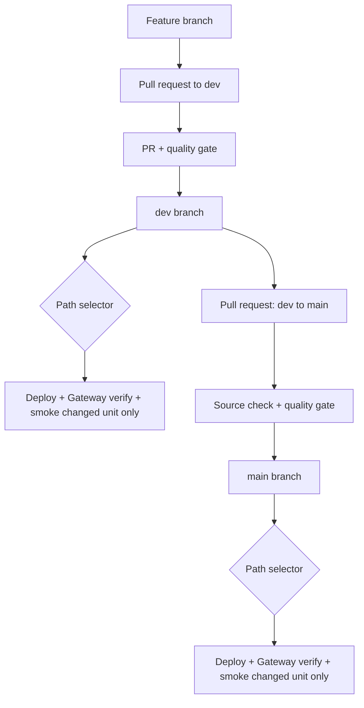

# CI/CD flow

GitHub Actions promotes the same repository state through development and
production. Production can only be reached from the repository's `dev` branch.

## Pull-request quality gate

The quality job runs on a GitHub-hosted Linux runner without Databricks
credentials. It:

1. Blocks implicit deletion or renaming of an agent manifest.
2. Installs the test dependencies with a pinned `uv` release.
3. Validates and composes every folder-defined agent.
4. Resolves generated App dependencies for Linux and Python 3.11.
5. Runs Ruff, pytest, and Omnigent YAML validation.
6. Compiles generated App source with Python 3.11.

Both branches require a pull request and their named status checks.
Administrators are subject to the rules, and force pushes and branch deletion
are blocked. CODEOWNERS identifies platform-owned files and requests review,
but approval is not required while this sandpit has only one collaborator:
GitHub does not allow a PR author to approve their own change. Require an
independent CODEOWNER approval when a second reviewer is added.

## Development deployment

A merged pull request pushes to `dev`. GitHub Actions then:

1. Compares the previous and current commit and selects deployment units by
   path while the quality gate runs.
2. Stops before packaging or requesting the deployment runner when no
   deployable unit changed.
3. Builds a short-lived deployment wheelhouse only for a deployable change.
4. Bootstraps `dev_agent_cicd` only when an App deployment is selected.
5. Validates, deploys, and starts only the selected unit.
6. Registers each selected agent App in Unity AI Gateway, reads its Agent
   Service and grants back, and fails closed on any mismatch.
7. Smoke-tests the selected unit. For any runtime-App change, it also exercises
   the complete Omnigent → LangChain → custom MCP path without redeploying
   unchanged consumers.

An `agents/gemini-assistant/**` change deploys only the Gemini App. A change to
the injected `agent_platform/**` intentionally deploys every folder-defined
agent, one at a time. Changes under `src/langchain_agent/`, `src/mcp_server/`,
or `src/omnigent_app/` select only that App. Documentation- and test-only
changes deploy nothing.

The selector result is a named GitHub Actions job output, so packaging and
deployment jobs cannot start before the scope is known. The deployment script
recomputes the selection from the same immutable commit range as a
defense-in-depth check.

## Measured small-change baseline

A one-line change to the existing LangChain example was promoted through both
environments on 28 July 2026. In each run the selector returned only
`langchain-assistant`; every sibling App kept its earlier update timestamp and
remained `RUNNING`/`ACTIVE`.

| Environment | Push to completion | DAB update | Deploy and verify |
| --- | ---: | ---: | ---: |
| [Development](https://github.com/zacdav-db/databricks-agent-cicd-sandpit/actions/runs/30329599152) | 2m 57s | 18s | 1m 35s |
| [Production](https://github.com/zacdav-db/databricks-agent-cicd-sandpit/actions/runs/30329830112) | 3m 07s | 19s | 1m 37s |

`Deploy and verify` includes target composition, DAB validation, App update,
Unity AI Gateway Agent Service registration, an invocation, and confirmation
that the invocation wrote an MLflow trace. A new App takes longer because
Databricks must create and start its compute; these figures measure the
representative update path for an already-running App.

## Production promotion

Production requires an internal pull request whose head is the repository's
`dev` branch and whose base is `main`. A dedicated check rejects any other
source, including a fork branch also named `dev`.

After merge, the `main` push is checked against its associated merged promotion
PR. CI repeats the quality gate and deploys only the `prod` target. There is no
manual-dispatch production path.

## App and target isolation

Each folder-defined agent has a complete generated DAB with a unique
`bundle.name` and workspace root. Its state contains exactly one App. Selecting
one agent therefore cannot plan, update, restart, or delete a sibling App.

The LangChain, MCP, and Omnigent Apps also have one bundle each. LangChain
references the custom MCP by target-specific App name, and Omnigent references
LangChain the same way, so those dependencies do not require shared bundle
state.

When all three are selected, deployment follows runtime dependency order:
MCP, LangChain, then Omnigent. Deployments remain sequential to avoid
overlapping App identity and OAuth updates in the shared sandpit workspace
while preserving independent bundle state.

When only one runtime App changes, only that App's DAB is deployed and
restarted. CI then invokes the already-running downstream consumers as an
acceptance test; those consumers are not planned or updated.

Both targets currently use the same workspace, catalog, warehouse, model
endpoint, and GitHub credential environment. They do not share:

- Schemas or Unity Catalog functions.
- App names or App service principals.
- MLflow experiments or trace tables.
- Agent Services or HTTP connections.
- Bundle root paths.

Every target-specific resource has an explicit `dev` or `prod` prefix. The
credential environments can be split later without changing the DAB contract.

The first isolated deployment transfers any existing folder App from the
former shared bundle state with DAB `deployment unbind` and `deployment bind`.
The App UUID and running App are preserved; no delete or forced restart is
used. Later deployments read and write only the agent's isolated state.

## Authentication and runners

Deployment jobs use OAuth M2M through the existing GitHub `production`
environment:

- Variable `DATABRICKS_HOST`
- Secret `DATABRICKS_CLIENT_ID`
- Secret `DATABRICKS_CLIENT_SECRET`

No PAT, local profile, or secret is committed. `register_uc_agent.py` reuses
the resolved `WorkspaceClient` credentials when an Agent Service connection
must be created.

The workspace IP ACL rejects ephemeral GitHub-hosted addresses. Only deployment
jobs use the repository-scoped `sandpit-deploy` self-hosted macOS ARM64 runner
on an authorized network. Pull-request validation stays on GitHub-hosted Linux.
The hosted job builds a one-day macOS wheelhouse so the network-restricted
deployment runner does not need PyPI access.

Databricks Apps themselves run on Linux/Python 3.11. The deployment client is
macOS only because that is the currently authorized runner. If an authorized
Linux runner is added, change its labels and the deployment wheelhouse platform
together.

The sandpit CI principal is a workspace administrator for idempotent bootstrap.
A production rollout should replace that broad role with explicit catalog,
experiment, App, and warehouse grants, and use a dedicated agent-caller
principal for Agent Service connections.
