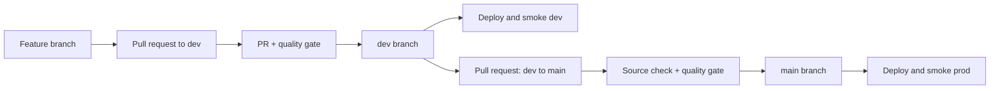

# CI/CD flow

GitHub Actions promotes the same repository state through development and
production. Production can only be reached from the repository's `dev` branch.

## Pull-request quality gate

The quality job runs on a GitHub-hosted Linux runner without Databricks
credentials. It:

1. Blocks implicit deletion or renaming of an agent manifest.
2. Installs the test dependencies with a pinned `uv` release.
3. Validates and composes every folder-defined agent.
4. Resolves generated App dependencies for Linux and Python 3.11.
5. Runs Ruff, pytest, and Omnigent YAML validation.
6. Compiles generated App source with Python 3.11.

Both branches require a pull request and their named status checks.
Administrators are subject to the rules, and force pushes and branch deletion
are blocked. CODEOWNERS identifies platform-owned files and requests review,
but approval is not required while this sandpit has only one collaborator:
GitHub does not allow a PR author to approve their own change. Require an
independent CODEOWNER approval when a second reviewer is added.

## Development deployment

A merged pull request pushes to `dev`. GitHub Actions then:

1. Repeats the quality gate.
2. Builds a short-lived deployment wheelhouse.
3. Bootstraps only `dev_agent_cicd`.
4. Composes and validates the complete DAB desired state.
5. Deploys and starts every dev App.
6. Reconciles the dev Unity Catalog Agent Services.
7. Runs end-to-end health, invocation, MCP, function, Omnigent, and trace
   checks.

## Production promotion

Production requires an internal pull request whose head is the repository's
`dev` branch and whose base is `main`. A dedicated check rejects any other
source, including a fork branch also named `dev`.

After merge, the `main` push is checked against its associated merged promotion
PR. CI repeats the quality gate and deploys only the `prod` target. There is no
manual-dispatch production path.

## Target isolation

Both targets currently use the same workspace, catalog, warehouse, model
endpoint, and GitHub credential environment. They do not share:

- Schemas or Unity Catalog functions.
- App names or App service principals.
- MLflow experiments or trace tables.
- Agent Services or HTTP connections.
- Bundle root paths.

Every target-specific resource has an explicit `dev` or `prod` prefix. The
credential environments can be split later without changing the DAB contract.

## Authentication and runners

Deployment jobs use OAuth M2M through the existing GitHub `production`
environment:

- Variable `DATABRICKS_HOST`
- Secret `DATABRICKS_CLIENT_ID`
- Secret `DATABRICKS_CLIENT_SECRET`

No PAT, local profile, or secret is committed. `register_uc_agent.py` reuses
the resolved `WorkspaceClient` credentials when an Agent Service connection
must be created.

The workspace IP ACL rejects ephemeral GitHub-hosted addresses. Only deployment
jobs use the repository-scoped `sandpit-deploy` self-hosted macOS ARM64 runner
on an authorized network. Pull-request validation stays on GitHub-hosted Linux.
The hosted job builds a one-day macOS wheelhouse so the network-restricted
deployment runner does not need PyPI access.

Databricks Apps themselves run on Linux/Python 3.11. The deployment client is
macOS only because that is the currently authorized runner. If an authorized
Linux runner is added, change its labels and the deployment wheelhouse platform
together.

The sandpit CI principal is a workspace administrator for idempotent bootstrap.
A production rollout should replace that broad role with explicit catalog,
experiment, App, and warehouse grants, and use a dedicated agent-caller
principal for Agent Service connections.
