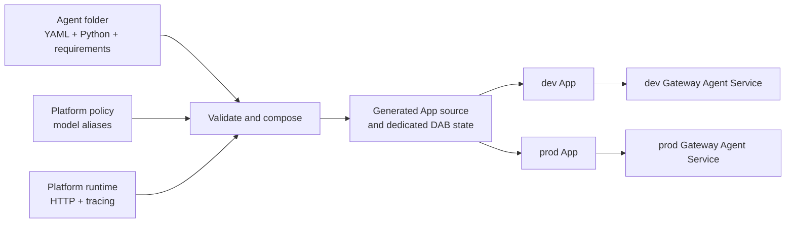

# Folder-defined agents

The folder contract lets an author contribute an agent without writing a
Databricks App, DAB resource, deployment script, or GitHub Actions job.

## Composition



The generated output is rebuilt before DAB validation and deployment. It is
not committed.

## Author contract

One direct child under `agents/` becomes one isolated Databricks App:

```text
agents/langchain-assistant/
├── agent.yaml
├── agent.py
└── requirements.txt
```

The complete manifest has three fields:

```yaml
name: langchain-assistant
model: default
entrypoint: agent:invoke
```

- `name` must match the folder and is limited to 19 lowercase letters, digits,
  or hyphens so the environment-prefixed App name remains valid.
- `model` is an alias from `agent_platform/policy.yaml`, not a raw serving
  endpoint.
- `entrypoint` uses importable `module:function` syntax.

The entrypoint may be synchronous or asynchronous:

```python
def invoke(message: str) -> str:
    return f"Received: {message}"
```

True streaming is an optional convention, not another YAML field:

```python
def invoke_stream(message: str):
    yield "Received: "
    yield message
```

The name is derived from the configured entrypoint. For
`entrypoint: agent:answer`, the platform looks for `answer_stream`. It accepts
synchronous and asynchronous iterators of strings. If the companion function
is absent, `/responses` remains compatible but emits the result of `invoke` as
one text delta.

This is a plain Python callable, not a base class or platform SDK. Agent code
can use LangChain, the OpenAI Agents SDK, or a custom implementation. When the
agent needs the approved Databricks model, it reads `MODEL_ENDPOINT`; the
platform resolves that value from the manifest's model alias and grants the
App permission to query it.

The function boundary is deliberate. Agent frameworks do not share a stable
input, output, or streaming object, so automatically detecting framework
objects would be brittle. The author makes that framework-specific conversion
inside `invoke` and, when needed, `invoke_stream`; the centrally managed
platform handles everything around them.

For example, an existing async agent only needs a thin call:

```python
async def invoke(message: str) -> str:
    result = await existing_agent.ainvoke(message)
    return str(result)
```

## Provider-native examples

The contract is exercised by four independently deployed folders:

| Folder | Author library | Model alias |
| --- | --- | --- |
| [`langchain-assistant`](../../agents/langchain-assistant) | LangChain | `default` |
| [`gemini-assistant`](../../agents/gemini-assistant) | Google Gen AI SDK | `gemini` |
| [`claude-assistant`](../../agents/claude-assistant) | Anthropic SDK | `claude` |
| [`openai-assistant`](../../agents/openai-assistant) | Databricks OpenAI client | `openai` |

The Gemini and Claude implementations use the providers' native
Databricks-compatible APIs. The OpenAI implementation uses
`DatabricksOpenAI`, which extends the OpenAI client with Databricks
authentication. In every case, `WorkspaceClient()` resolves the App identity;
no static provider or Databricks token is passed through the manifest.

See the official Databricks guides for the
[Google Gemini API](https://docs.databricks.com/aws/en/machine-learning/model-serving/query-gemini-api),
[Anthropic Messages API](https://docs.databricks.com/aws/en/machine-learning/model-serving/query-anthropic-messages),
and
[OpenAI-compatible client](https://docs.databricks.com/aws/en/machine-learning/model-serving/query-chat-models).

## What the platform adds

`scripts/compose_agents.py` validates every folder and atomically builds
`.generated/`. For each agent it:

1. Copies the validated author source.
2. Injects the platform FastAPI runtime.
3. Combines the exact-pinned platform and author dependencies.
4. Emits a deterministic, single-App DAB.
5. Gives the App a unique bundle name and workspace state root.
6. Records the deployment unit in an index consumed by selection,
   registration, and focused smoke tests.

The platform owns:

- The standard MLflow AgentServer `/responses` endpoint, including Server-Sent
  Events and trace-ID events, plus `/`, `/api/health`, and the legacy
  `/api/invocations` compatibility route.
- Input bounds, error handling, a 120-second timeout, and thread handling for
  synchronous functions.
- MLflow tracing and returned trace IDs.
- Target-specific experiment, warehouse, and Unity Catalog trace bindings.
- App commands, names, identities, permissions, model grants, and DAB shape.
- Dev/prod startup, mandatory Unity AI Gateway Agent Service registration,
  read-back verification, and acceptance testing.

The tracing bootstrap runs before the author module is imported. It enables
the installed LangChain, OpenAI, Anthropic, and Gemini MLflow integrations;
their model calls become child spans of the platform's root invocation span.
See [platform-owned tracing](platform-tracing.md) for the capture boundaries
and the externally hosted example.

The deployed smoke test sends `"stream": true` to every example and requires
multiple text deltas, a completed output item, a terminal event, and a
queryable platform stream span. It separately invokes the ordinary entrypoint
and requires a provider child span, so streaming transport and automatic
provider instrumentation are both tested within their supported boundaries.
See Databricks'
[custom-agent authoring guide](https://docs.databricks.com/aws/en/agents/custom-agents/author-agent)
for the Responses API event contract.

## Deployment isolation

Every folder gets a self-contained generated directory:

```text
.generated/bundles/langchain-assistant/
├── databricks.yml
└── app/
```

That bundle contains one App and has a unique `bundle.name`. CI maps changed
paths to these bundle directories, so an agent-only pull request reconciles
only its own App. It does not restart sibling compute or depend on sibling
smoke tests.

Shared runtime or model-policy changes are different by design: because their
generated output affects every folder, CI fans out across all agent bundles
sequentially.

## Validation boundary

The contract is intentionally strict. CI rejects:

- Missing, duplicate, or unknown YAML fields.
- Invalid, reserved, mismatched, or oversized names.
- Missing entrypoints, invalid syntax, or the wrong function signature.
- An invalid optional streaming function signature.
- Python that does not compile on the Databricks Python 3.11 runtime.
- Symlinks, hidden files, reserved runtime paths, large files, and credential
  file types.
- Arbitrary model endpoints.
- Requirement directives, markers, URLs, VCS/local paths, non-exact pins, and
  attempts to override platform packages.
- Author-defined environment variables, permissions, commands, raw resources,
  or DAB fragments.

Dependency resolution is tested for Linux/Python 3.11 with binary wheels only.
After deployment, CI verifies the App's Gateway Agent Service and grants,
invokes the App, and waits until its trace is queryable in the target's Unity
Catalog spans table.

## Design boundaries

This is trusted-contributor Python, not a sandbox for untrusted code. Agent
code runs with its App identity and can use whatever that identity is granted.

One folder creates one App identity, DAB state, deployment unit, and scaling
boundary. The Python may still coordinate several logical subagents internally.

The platform remains in this repository so the contract, runtime, DAB
composition, and deployment logic change atomically. Once stable, the
composer and runtime can become a separately versioned platform package
without adding an author-facing SDK.

Folder deletion and renaming are destructive infrastructure operations and
are currently blocked. Add an explicit retirement workflow before allowing
them.

Future functions, MCP servers, App dependencies, secrets, or access profiles
should be introduced as typed, allowlisted contract capabilities. Raw DAB YAML
should not become part of the author surface.

For the concise author checklist, see [`agents/README.md`](../../agents/README.md).
