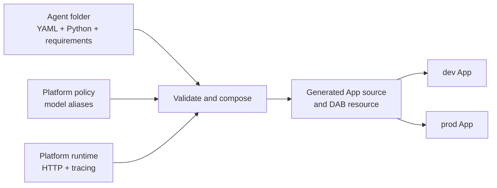

# Folder-defined agents

The folder contract lets an author contribute an agent without writing a
Databricks App, DAB resource, deployment script, or GitHub Actions job.

## Composition



The generated output is rebuilt before DAB validation and deployment. It is
not committed.

## Author contract

One direct child under `agents/` becomes one isolated Databricks App:

```text
agents/minimal-assistant/
├── agent.yaml
├── agent.py
└── requirements.txt
```

The complete manifest has three fields:

```yaml
name: minimal-assistant
model: default
entrypoint: agent:invoke
```

- `name` must match the folder and is limited to 19 lowercase letters, digits,
  or hyphens so the environment-prefixed App name remains valid.
- `model` is an alias from `agent_platform/policy.yaml`, not a raw serving
  endpoint.
- `entrypoint` uses importable `module:function` syntax.

The entrypoint may be synchronous or asynchronous:

```python
from agent_sdk import AgentContext


async def invoke(message: str, context: AgentContext) -> str:
    return f"{context.name} received: {message}"
```

`AgentContext` supplies the immutable agent name, resolved model endpoint, and
deployment target.

## What the platform adds

`scripts/compose_agents.py` validates every folder and atomically builds
`.generated/`. For each agent it:

1. Copies the validated author source.
2. Injects the stable `agent_sdk`.
3. Injects the platform FastAPI runtime.
4. Combines the exact-pinned platform and author dependencies.
5. Emits a deterministic DAB App resource.
6. Records the resource in a deployment index consumed by registration and
   smoke tests.

The platform owns:

- `/`, `/api/health`, and `/api/invocations`.
- Input bounds, error handling, a 120-second timeout, and thread handling for
  synchronous functions.
- MLflow tracing and returned trace IDs.
- Target-specific experiment, warehouse, and Unity Catalog trace bindings.
- App commands, names, identities, permissions, model grants, and DAB shape.
- Dev/prod startup, Agent Service registration, and acceptance testing.

## Validation boundary

The contract is intentionally strict. CI rejects:

- Missing, duplicate, or unknown YAML fields.
- Invalid, reserved, mismatched, or oversized names.
- Missing entrypoints, invalid syntax, or the wrong function signature.
- Python that does not compile on the Databricks Python 3.11 runtime.
- Symlinks, hidden files, reserved runtime paths, large files, and credential
  file types.
- Arbitrary model endpoints.
- Requirement directives, markers, URLs, VCS/local paths, non-exact pins, and
  attempts to override platform packages.
- Author-defined environment variables, permissions, commands, raw resources,
  or DAB fragments.

Dependency resolution is tested for Linux/Python 3.11 with binary wheels only.
The generated App is then invoked after deployment, and CI waits until its
trace is queryable in the target's Unity Catalog spans table.

## Design boundaries

This is trusted-contributor Python, not a sandbox for untrusted code. Agent
code runs with its App identity and can use whatever that identity is granted.

One folder creates one App identity and scaling boundary. The Python may still
coordinate several logical subagents internally.

V1 remains in this repository so the contract, runtime, DAB composition, and
deployment logic change atomically. Once stable, the composer and `agent_sdk`
can become a separately versioned platform package.

Folder deletion and renaming are destructive infrastructure operations and are
blocked in v1. Add an explicit retirement workflow before allowing them.

Future functions, MCP servers, App dependencies, secrets, or access profiles
should be introduced as typed, allowlisted contract capabilities. Raw DAB YAML
should not become part of the author surface.

For the concise author checklist, see [`agents/README.md`](../../agents/README.md).
