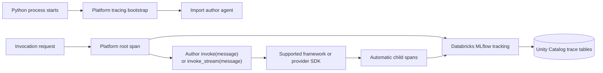
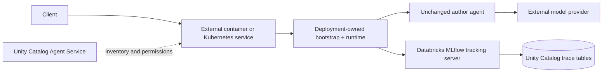

# Platform-owned tracing

The platform can add useful tracing without changing an agent author's source
when it controls two points in the deployed process:

1. A bootstrap that runs before the author module is imported.
2. The request or invocation boundary that calls the author's entrypoint.

Folder-defined Apps call the bootstrap from health or invocation before their
first author import. The external example runs it even earlier through Python's
deployment-owned `sitecustomize.py` startup hook.



## What is injected

`agent_platform/_platform_tracing.py` selects the DAB-bound experiment and
enables MLflow autologging for installed LangChain, OpenAI, Anthropic, and
Gemini packages. The generated runtime calls it before importing the author's
entrypoint. It then creates a root `CHAIN` span around each invocation.

The author still supplies only the ordinary invocation function:

```python
def invoke(message: str) -> str:
    ...
```

An author who needs true token streaming may optionally expose
`invoke_stream(message)` as a synchronous or asynchronous iterator. This is a
naming convention, not a platform import or manifest field.

No author import, decorator, base class, or framework-specific adapter is
required. Automatic SDK spans inherit the active root context in the same
Python process, producing one trace for the request. For streaming, the root
span and a nested platform stream span remain open while chunks are yielded;
both store the concatenated text as their final output.

## Capture boundary

| Activity | Captured without author changes? | Why |
| --- | --- | --- |
| Request input, final output, latency, and failure | Yes | The platform owns both non-streaming and streaming request boundaries. |
| Supported LangChain, OpenAI, Anthropic, or Gemini calls | Yes, within the integration's feature support | MLflow autologging patches the installed SDK before author import. |
| Custom Python tool or business logic | Root duration only | Internal steps need manual spans or an instrumented library. |
| Raw HTTP calls or unsupported SDKs | Root duration only | There is no semantic integration to create child spans. |
| Detached processes, queues, or remote subagents | No automatic parentage | Trace context must be propagated and tracing enabled in the other process. |
| Existing server where deployment cannot control startup or requests | Provider calls at most | A startup hook can enable autologging, but a root request span needs middleware or a wrapper. |

Current provider integrations also have feature boundaries. The platform can
always capture its root streaming span, but provider-level streaming and
multimodal child-span coverage varies by integration and SDK version. Test the
exact API style before treating child-span coverage as a compliance guarantee.

The platform treats tracing as mandatory. If an installed provider's pinned
MLflow integration cannot initialize, readiness fails instead of silently
shipping only partial traces. CI resolves the pinned Linux dependencies, and
the deployed smoke test requires a nested platform span on the streaming trace.
A separate non-streaming probe requires a provider span whose parent is the
platform root. The split is intentional: MLflow 3.14 records every platform
streaming boundary, while provider SDK streaming instrumentation remains
integration-specific.

## Outside Databricks

The same pattern works when compute is hosted elsewhere:



The external deployment sets `DATABRICKS_HOST`,
`DATABRICKS_AUTH_TYPE=oauth-m2m`, `DATABRICKS_CLIENT_ID`, and
`DATABRICKS_CLIENT_SECRET`. Databricks unified authentication refreshes OAuth
tokens; `MLFLOW_TRACKING_URI=databricks` and `MLFLOW_EXPERIMENT_ID` select an
already-provisioned Unity Catalog-backed trace destination.

See the runnable [`examples/external-agent`](../../examples/external-agent).
It uses Python's deployment-owned `sitecustomize.py` startup hook plus the
same platform invocation runtime, while its author file contains no Databricks
or MLflow code. The container exposes the same `/responses` streaming
contract as a Databricks-hosted folder agent.

Registering the external endpoint as an Agent Service is optional and does not
create traces by itself. Agent Services currently govern inventory and
permissions but do not proxy live invocation, so the external process must
send its own MLflow traces.

Official references:

- [Automatic tracing integrations](https://docs.databricks.com/aws/en/mlflow3/genai/tracing/app-instrumentation/automatic)
- [Trace agents deployed outside Databricks](https://docs.databricks.com/aws/en/mlflow3/genai/tracing/prod-tracing-external)
- [Databricks unified authentication](https://docs.databricks.com/aws/en/dev-tools/auth/)
- [Agent Services in Unity Catalog](https://docs.databricks.com/aws/en/ai-gateway/agent-services)
- [Author an agent with the Responses API](https://docs.databricks.com/aws/en/agents/custom-agents/author-agent)
