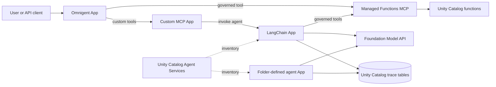

# Runtime example

This example shows how several agent and tool styles can coexist while each
Databricks App retains its own Asset Bundle state, App identity, and governed
resource bindings.

The same topology is deployed twice. `dev` and `prod` share the sandpit
workspace, catalog, model endpoint, and SQL warehouse, but use different App
names, schemas, functions, experiments, Agent Services, connections, bundle
roots, and trace tables.

## One target

## Components

| Component | Purpose |
| --- | --- |
| `*-sandpit-langchain-agent` | FastAPI LangChain agent using a Databricks Foundation Model and managed Unity Catalog function MCP servers. |
| `*-sandpit-mcp-tools` | Custom Streamable HTTP MCP server with tools and a bridge to the LangChain App. |
| `*-sandpit-omnigent` | Omnigent supervisor that uses the custom MCP, a managed UC function, and approval policies. |
| `*-agent-langchain-assistant` | Example App using LangChain through the folder-defined agent contract. |
| Managed Functions MCP | Databricks-managed MCP surface over the target's Unity Catalog functions. |
| Agent Services | Beta Unity Catalog inventory and permissions for the fixed and generated agent Apps. |
| Trace tables | Four governed OpenTelemetry tables backing the target's MLflow experiment. |

## Unity Catalog mapping

Each DAB maps its supported objects at the strongest level currently available:

- The cost and current-time tools are three-level Unity Catalog `FUNCTION`
  securables. Agent Apps receive `EXECUTE` through DAB `uc_securable` bindings
  and discover them through managed Functions MCP endpoints.
- The fixed LangChain App and every folder-defined agent are registered after
  deployment as target-specific Unity Catalog Agent Services. The sandpit
  owner receives `EXECUTE` and `READ_METADATA`.
- Agent Services currently provide beta inventory and permissions. Live
  traffic continues to use the DAB-deployed App endpoints.
- The custom MCP remains a stateless Databricks App. Databricks does not
  currently support registering an App as a Unity Catalog MCP Service.
- Trace data is governed in Unity Catalog rather than written to a shared,
  cross-target table.

DAB CLI `1.7.x` has no first-class resource types for UC functions, HTTP
connections, Agent Services, or MCP Services. Deployment therefore combines
native App resources with two platform scripts:

- `bootstrap_resources.py` creates the target schema, functions, and MLflow
  experiment before App bindings are deployed.
- `register_uc_agent.py` uses `WorkspaceClient` and its authenticated API
  client to reconcile the beta Agent Service resources.

See the Databricks documentation for
[managed MCP servers](https://docs.databricks.com/aws/en/agents/mcp/managed-mcp),
[Agent Services](https://docs.databricks.com/aws/en/ai-gateway/agent-services),
and
[MCP Service limitations](https://docs.databricks.com/aws/en/agents/mcp/mcp-services).

## Trace storage

Each target has an MLflow experiment backed by four SQL-queryable Unity
Catalog OpenTelemetry tables:

| Target | MLflow experiment | UC schema | Table prefix |
| --- | --- | --- | --- |
| dev | `/Shared/dev-sandpit-agent-cicd-traces` | `zacdav_sandpit_catalog.dev_agent_cicd` | `dev_sandpit_agent_cicd_otel_*` |
| prod | `/Shared/prod-sandpit-agent-cicd-traces` | `zacdav_sandpit_catalog.prod_agent_cicd` | `prod_sandpit_agent_cicd_otel_*` |

Each prefix expands to `annotations`, `logs`, `metrics`, and `spans`. Nothing
in either target binds to the other target's schema. Each deployment runs a
focused smoke test for only the selected App; agent tests wait until their
trace is queryable in the target's spans table.

## Omnigent behavior

The supervisor definition is
[`src/omnigent_app/sandpit_supervisor/config.yaml`](../../src/omnigent_app/sandpit_supervisor/config.yaml).
It demonstrates:

- A remote custom MCP server authenticated with Databricks OAuth.
- A governed Unity Catalog function exposed through managed Functions MCP.
- A subagent that reaches the LangChain App through the custom MCP bridge.
- An `ASK` policy before `sys_session_send` or `sys_session_create`.
- An `ASK` policy whenever cumulative Omnigent spend reaches a new whole
  dollar checkpoint.

Omnigent evaluates spend at turn and tool boundaries. If one turn crosses
several checkpoints, it asks once at the highest newly crossed checkpoint.
The policy measures Omnigent LLM spend; the downstream LangChain App records
its own MLflow trace.

Databricks Apps supplies Python 3.11, while Omnigent 0.6 requires Python 3.12.
The Omnigent launcher uses `uvx` for an isolated Python 3.12 runtime. This
sandpit uses Omnigent local single-user mode; a multi-user rollout should use
its shared-server SSO mode.
