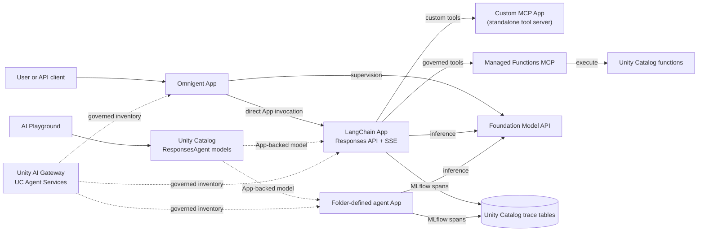

# Runtime example

This example shows how several agent and tool styles can coexist while each
Databricks App retains its own Asset Bundle state, App identity, and governed
resource bindings.

The same topology is deployed twice. `dev` and `prod` share the sandpit
workspace, catalog, model endpoint, and SQL warehouse, but use different App
names, schemas, functions, experiments, Agent Services, connections, bundle
roots, and trace tables.

## One target

## Components

| Component | Purpose |
| --- | --- |
| `agent-*-sandpit-langchain` | MLflow AgentServer LangChain agent with streaming Responses API, a Databricks Foundation Model, the custom MCP App, and managed Unity Catalog function MCP servers. The `agent-` prefix and ResponsesAgent metadata make it compatible with AI Playground. |
| `mcp-*-sandpit-tools` | Standalone custom Streamable HTTP MCP server. It exposes tools but has no agent dependency. The `mcp-` prefix makes the App discoverable as an MCP server in AI Playground. |
| `*-sandpit-omnigent` | Omnigent supervisor that delegates directly to the LangChain App and applies approval policies. |
| `agent-*-langchain-assistant` | Example ResponsesAgent App using LangChain through the folder-defined agent contract. |
| Managed Functions MCP | Databricks-managed MCP surface over the target's Unity Catalog functions. |
| Unity AI Gateway | Governed Agent Service inventory and permissions for every agent App. |
| UC registered models | Versioned ResponsesAgent signatures and App dependencies for the fixed LangChain and folder-defined agents. |
| Trace tables | Four governed OpenTelemetry tables backing the target's MLflow experiment. |

## Unity Catalog mapping

Each DAB maps its supported objects at the strongest level currently available:

- The cost and current-time tools are three-level Unity Catalog `FUNCTION`
  securables. The LangChain App receives `EXECUTE` through DAB
  `uc_securable` bindings and discovers them through managed Functions MCP
  endpoints.
- The LangChain DAB declares the custom MCP App as a
  [Databricks App resource](https://docs.databricks.com/aws/en/dev-tools/databricks-apps/apps-resource)
  with `CAN_USE`. The LangChain App resolves its target-specific URL and loads
  its tools alongside the managed function tools.
- The Omnigent DAB declares the LangChain App as a
  [Databricks App resource](https://docs.databricks.com/aws/en/dev-tools/databricks-apps/apps-resource)
  with `CAN_USE`. Its deployment-owned function tool invokes LangChain's
  `/api/invocations` endpoint directly.
- External clients and the LangChain Agent Service use `/responses`. A
  `"stream": true` request receives text deltas as LangGraph emits model
  chunks, followed by the completed item, MLflow trace ID, and terminal SSE
  event.
- The fixed LangChain and folder-defined App names start with `agent-`. CI
  verifies `/agent/info` reports `use_case=agent` and
  `agent_api=responses`, the App contract used by AI Playground.
- Each of those agent DABs also declares a native
  [`registered_models` resource](https://docs.databricks.com/aws/en/dev-tools/bundles/resources#registered-model)
  in its target schema. After the App smoke test succeeds, MLflow creates an
  idempotent model version with the standard ResponsesAgent signature,
  streaming enabled, and a `DatabricksApp` resource dependency. CI moves the
  `deployed` alias to that version and reads the artifact back before the
  deployment passes.
- The model's DAB grant uses the configured account user rather than the
  workspace-local `users` group, which Unity Catalog does not accept as a
  principal in this sandpit.
- The UC model is the governed, versioned discovery record. Its inference
  implementation delegates to the target-specific Databricks App, which
  remains the only serving runtime. No Model Serving endpoint is introduced.
- The fixed LangChain App, Omnigent supervisor, and every folder-defined agent
  are registered after deployment as target-specific Unity Catalog Agent
  Services in Unity AI Gateway. The sandpit owner receives `EXECUTE` and
  `READ_METADATA`.
- Registration is fail-closed. CI reads the service and permission records
  back and checks the expected App connection, base path, service type, and
  grants before smoke testing the agent.
- Agent Services currently provide beta inventory and permissions. Live
  traffic continues to use the DAB-deployed App endpoints.
- The custom MCP remains a stateless Databricks App. Databricks does not
  currently support registering an App as a Unity Catalog MCP Service. Its
  App name starts with `mcp-`, as required for AI Playground discovery.
- Trace data is governed in Unity Catalog rather than written to a shared,
  cross-target table.

DAB CLI `1.7.x` provides first-class App and UC registered-model resources,
but not resource types for UC functions, HTTP connections, Agent Services, or
MCP Services. Deployment therefore combines native DAB resources with three
platform scripts:

- `bootstrap_resources.py` creates the target schema, functions, and MLflow
  experiment before App bindings are deployed.
- `register_uc_agent.py` uses `WorkspaceClient` and its authenticated API
  client to reconcile and verify the beta Gateway Agent Service resources.
- `register_uc_model.py` uses MLflow to create or reuse the commit's model
  version, assign its `deployed` alias, and verify its ResponsesAgent signature
  and App dependency.

See the Databricks documentation for
[hosting custom MCP servers as Apps](https://docs.databricks.com/aws/en/agents/mcp/custom-mcp),
[managed MCP servers](https://docs.databricks.com/aws/en/agents/mcp/managed-mcp),
[Agent Services](https://docs.databricks.com/aws/en/ai-gateway/agent-services),
[models in Unity Catalog](https://docs.databricks.com/aws/en/machine-learning/manage-model-lifecycle/),
and
[MCP Service limitations](https://docs.databricks.com/aws/en/agents/mcp/mcp-services).
The streaming route follows Databricks'
[custom-agent Responses API contract](https://docs.databricks.com/aws/en/agents/custom-agents/author-agent).
See also the official
[AI Playground App naming convention](https://docs.databricks.com/aws/en/getting-started/gen-ai-llm-agent#step-3-export-your-agent)
and
[querying ResponsesAgent Apps](https://docs.databricks.com/aws/en/agents/custom-agents/query-agent).

## Trace storage

Each target has an MLflow experiment backed by four SQL-queryable Unity
Catalog OpenTelemetry tables:

| Target | MLflow experiment | UC schema | Table prefix |
| --- | --- | --- | --- |
| dev | `/Shared/dev-sandpit-agent-cicd-traces` | `zacdav_sandpit_catalog.dev_agent_cicd` | `dev_sandpit_agent_cicd_otel_*` |
| prod | `/Shared/prod-sandpit-agent-cicd-traces` | `zacdav_sandpit_catalog.prod_agent_cicd` | `prod_sandpit_agent_cicd_otel_*` |

Each prefix expands to `annotations`, `logs`, `metrics`, and `spans`. Nothing
in either target binds to the other target's schema. Each deployment runs a
focused smoke test for only the selected App; agent tests wait until their
trace is queryable in the target's spans table.

## Omnigent behavior

The supervisor definition is
[`src/omnigent_app/sandpit_supervisor/sandpit_supervisor.yaml`](../../src/omnigent_app/sandpit_supervisor/sandpit_supervisor.yaml).
It demonstrates:

- A subagent that invokes the LangChain App directly with Databricks App
  authentication.
- Indirect access to custom MCP and governed Unity Catalog function tools
  through LangChain's tool-calling loop.
- An `ASK` policy before `sys_session_send` or `sys_session_create`.
- An `ASK` policy whenever cumulative Omnigent spend reaches a new whole
  dollar checkpoint.

Omnigent evaluates spend at turn and tool boundaries. If one turn crosses
several checkpoints, it asks once at the highest newly crossed checkpoint.
The policy measures Omnigent's supervisory LLM spend. The downstream
LangChain App records its own MLflow trace, including its model and MCP tool
spans. The custom MCP is independently deployable and contains no callback or
bridge to LangChain.

The sandpit supervisor is one Omnigent user behind the
[Databricks Apps authentication boundary](https://docs.databricks.com/aws/en/dev-tools/databricks-apps/auth).
This keeps its colocated host visible to both interactive users and the CI
service principal without bypassing App authentication.

Databricks Apps supplies Python 3.11, while Omnigent 0.6 requires Python 3.12.
The Omnigent launcher uses `uvx` for an isolated Python 3.12 runtime. This
sandpit uses Omnigent local single-user mode; a multi-user rollout should use
its shared-server SSO mode. Omnigent filters the environment of spawned
runners, so the launcher explicitly passes through only the deployment-owned
LangChain App URL; Databricks credentials continue through Omnigent's built-in
Databricks profile handling.
